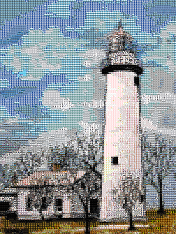

# Moosaic: A program for creating BMP Photomosaics written in OCaml 
### Gabriela Merz, Dino Rodriguez, Chase Davis, and Samuel Stone 

# Instructions for Using Moosaic 
For Pre-Installation, You MUST install camlimages! Also, please navigate to ~/.ocamlinit and make sure you delete any reference to Core.Std, as having the standard libraries will actually interfere with our program.

To run Moosaic: 

1. Open up main.ml in Emacs
2. In a Utop terminal within Emacs, run the following command: #require "camlimages"
3. Compile main.ml using ctrl c ctrl b
4. Put the image you want to make a mosaic out of in the same folder as main.ml. Make sure the file is of type BMP. We've provided some sample images in the sample bmps folder
5. Run the command masterpiece n "image name" where n is the number of tiles you would like your photo-mosaic to be comprised of, and image_name is the filename of the image you would like to create a mosaic out of 

# Files

The three files that we worked in are kdtrees.ml, kdtest.ml, and pixels.ml. kdtrees.ml is the structure for the kd tree we used to store images--including the nearest neighbor function that is the heart of the program. In kdtest.ml are the tests we wrote along the way to make sure everything was working, and pixels.ml creates the photo-mosaic and is the main integration with camlimages. 

# Installing CamlImages 
How we installed camlimages (after lots of trial and error): 

1. Download and install camlimages and make via “sudo opam install camlimages”

2. Unlock appropriate permissions

3. Camlimages package should now appear in utop when you run #list “camlimages”;;

# More 

